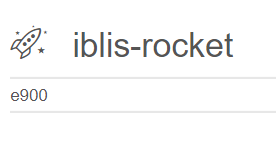
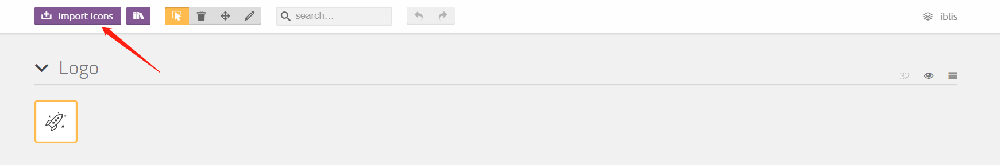
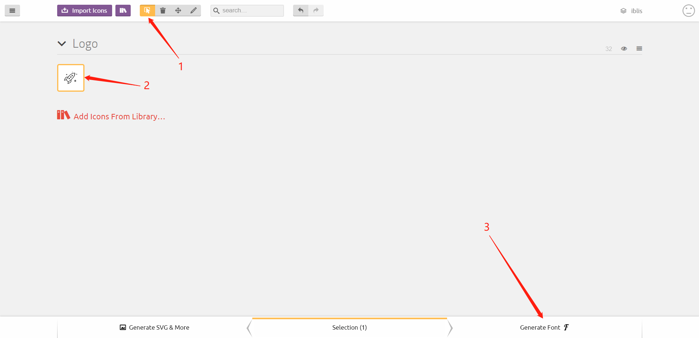

:sunglasses: _**Iblis Font -**_ Embedding SVG by creating your own font

CSS and web font files example to easily self-host your own logos or icons.



The purpose is also to show how to create your own font.

## 🧐 &nbsp; Why

When you use javascript or typescript (with React or React Native for example) it could be difficult to display a SVG file in your app.

Many libraries exists but looks a little too much complicated to use :
* [React Inlinesvg](https://github.com/gilbarbara/react-inlinesvg)
* [React Native Svg](https://github.com/react-native-community/react-native-svg)

## 💡 &nbsp; Solution

By creating your own font, you can easily use your SVG file by displaying it like text.

## 📟 &nbsp; Demos

- [See fonts](https://iblis-font.github.io/)
- [Demo source](./docs)

## 📌 &nbsp; Install

`npm install iblis-font`
or
`yarn install iblis-font`

## 💻 &nbsp; Usage

Iblis-Font assume you’re using webpack to process CSS and files. Each typeface package includes all necessary font files (woff, eot, ttf, svg) and a CSS file with font-face declarations pointing at these files.

You will need to have webpack setup to load css and font files. Many tools built with Webpack will work out of the box with Typefaces such as [Gatsby](https://github.com/gatsbyjs/gatsby) and [Create React App](https://github.com/facebookincubator/create-react-app).

To use, simply require the package in your project’s entry file e.g.

```javascript
// Load Iblis Font
require('iblis-font')
```

You can then display the icon by typing :

`&#xe900;`

If you are using react native for iOS : 
In info.plist add for the key: <key>UIAppFonts</key> the value in array <string>iblis-font.ttf</string>
`react-native link`

## How to create your own font

First you need to have your icons in SVG format

To create the font I use the online tools: [IcoMoon App](https://icomoon.io/)

You need to import your svg file


Then select all the icon your want for your font and click on generate font


Then in the zip you can find the fonts in the /fonts folder and the style.css

## 🕺 &nbsp; Contribute

1.  [Fork](https://help.github.com/articles/fork-a-repo/) this repository to your own GitHub account and then [clone](https://help.github.com/articles/cloning-a-repository/) it to your local device
2.  Send a pull request 🙌